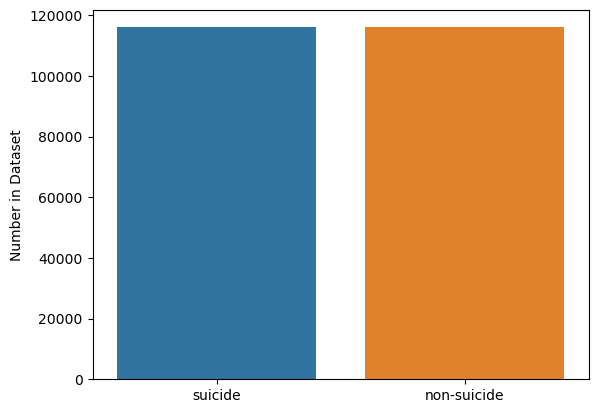
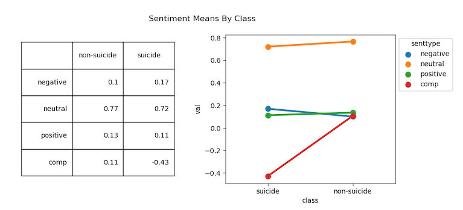
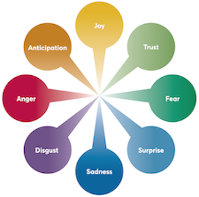
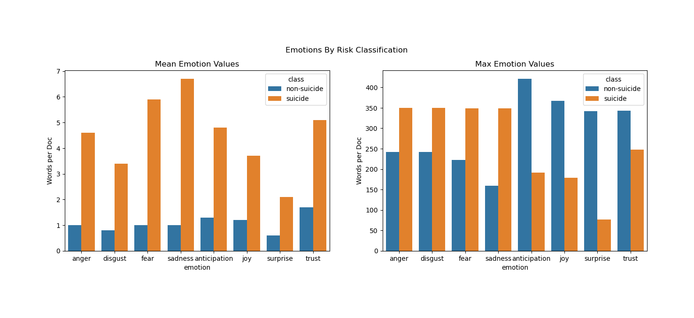

# Text-Based Suicide Risk Detection Model for Mental Health Chatbots

**Author:** [Roshni Janakiraman](https://www.linkedin.com/in/roshni-janakiraman/)


## Project Overview

The goal of this project was to build a Natural Language Processing model to classify suicide risk. I trained a Logistic Regression model to classify suicide vs. non-suicide risk text based on relevant keywords, sentiment scores, and emotion word counts from [over 200,000 reddit posts](https://www.kaggle.com/datasets/nikhileswarkomati/suicide-watch). The final model achieved an accuracy of **91.5%** in distinguishing suicide risk text from non-suicide risk text, and minimized false negatives with a recall rate of **92.5%**. 


## I. Business Understanding

#### 	Target Stakeholder

Mental Health Chatbot Companies (such as [Pyx](https://www.pyxhealth.com/how-it-works/), [WoeBot](https://woebothealth.com/))

### Business Case

* With the rising rates of mental illness and the growing shortage of mental health professionals in the United States [over recent years](https://www.npr.org/2022/10/10/1127889101/the-mental-health-crisis-and-shortage-of-providers-is-creating-big-debt-for-amer), people have been increasingly seeking support from [mental health chatbots.](https://valionhealth.com.au/blog/chatbots/)
* [Over 40% of Americans](https://psychnews.psychiatryonline.org/doi/10.1176/appi.pn.2022.05.4.50) exclusively use chatbot services over in-person therapy, most of whom find them [effective](https://dl.acm.org/doi/fullHtml/10.1145/3453175).
* However, mental health chatbots are limited in their abilities. There are populations for whom mental health chatbots are not yet able to provide suitable care, such as **clients at risk for suicide.**
  * Unconstrained chatbots have been shown to ignore and even encourage [self-harm and suicide](https://towardsdatascience.com/unconstrained-chatbots-condone-self-harm-e962509be2fa).

### Problem

* Given  [5% of the US population reported experiencing suicidal thoughts](https://www.cdc.gov/mmwr/volumes/71/ss/ss7101a1.htm), it is essential for mental health chatbots to be able to detect suicide risk and respond appropriately.
    1. Serious [legal and ethical ramifications](https://www.ncbi.nlm.nih.gov/pmc/articles/PMC8521996/#B17) of failing to respond properly to suicide risk
    2. This will allow mental health companies to better implement their [safeguards for high-risk clients](https://laist.com/news/health/therapy-by-chatbot-the-promise-and-challenges-in-using-ai-for-mental-health)
    3. A model that can detect suicide risk will **increase the efficiency of care** of mental health chatbots

### Project Goals

To create a model to classify individuals as **at suicide risk** or **not at suicide risk** based on a text analysis of their messages, using the following features: *word relevance*, *sentiment analysis*, and *emotion detection*.

#### 1. High Accuracy Rate

* Model should accurately classify text as indicative of suicide risk vs. non risk

#### 2. High Recall Rate: Minimize *False Negatives*

* False Negative are failing to detect suicide risk in clients who *actually are* at risk
* False negative classifications are *dangerous*, since clients who need intervention would not get the support they need.

#### 3. Quick Run Time 

* Model should generate predictions from unseen text *efficiently*, so that it can be deployed to work *in real time* with the mental health chatbot

  

## II. Data Understanding

### Data Source

The dataset used for this project was the *Suicide and Depression Dataset* from [Kaggle](https://www.kaggle.com/datasets/nikhileswarkomati/suicide-watch).

* This dataset consists over **over 200,000** posts webscraped from Reddit between December 2008 - January 2021 using Pushshift API. Posts were collected from "r/SuicideWatch" and "r/Teenagers"

* **<u>Suicide Risk</u>** text was sourced from "r/SuicideWatch," a forum that provides "peer support for anyone struggling with suicidal thoughts."
  
* **<u>No Suicide Risk</u>** text was sourced from "r/Teenagers," a forum for "average teenager discussions"

### Data Description

This dataset consists of **232,074** posts from reddit. Each post was treated as an individual document. The dataset was evenly split between suicide risk and non-suicide risk posts:



### Data Quality:

#### Notable strengths of current dataset:

1. **Large Sample Size** - hard to find mental health data of this size, especially with confidentiality constraints
2. **Equal Representation of Suicide Risk vs. Non-Risk class** - balanced classes are [rare in suicide research](https://www.ncbi.nlm.nih.gov/pmc/articles/PMC8370663/)

#### Weaknesses of current dataset:

1. **Cleanliness of Data**: Raw text needed *a lot* of cleaning: -- misspellings, unidentifiable characters, inconsistent spacing
    * Even with intensive cleaning techniques, I could not completely clean the data. There was a trade-off between clean data and keeping authenticity of the data: for example, running a spellcheck altered the meaning of many sentences, so was ultimately not feasible.
    
2. **Filtering Spam Posts**
    * Many spam posts were difficult to detect, as they were formatted well enough to evade Reddit's spam filters.
    
3. **Control (non-suicide risk) group posts coming from r/Teenagers**
    * Not necessarily representative of non-suicide risk population, much less mental health chatbot users. In future studies, it would be better to use a group more indicative of support seekers.
    
      

## III. Data Exploration

### Data Preparation Process

For details on my data preparation process, please refer to my Jupyter [Notebook #1]("./1-Intro-and-Data-Prep.ipynb"). Data Preparation steps included:

1. Text Cleaning and Pre-Processing
2. Feature Extraction - Sentiment Analysis & Emotion Detection
3. Final Dataframe preparation

### Feature Extraction & Descriptives

My model used three extracted features from the text:

1. Relevant Keywords (using [TF-IDF Vectorizer](https://scikit-learn.org/stable/modules/generated/sklearn.feature_extraction.text.TfidfVectorizer.html) )
2. Sentiment Analysis (using [VADER Sentiment](https://github.com/cjhutto/vaderSentiment))
3. Emotion Detection (using [NRCLex](https://pypi.org/project/NRCLex/))

Since the latter two features (*sentiment analysis* and *emotion detection*) were calculated solely using pre-defined rules, I was able to calculate them prior to the train-test split and examine descriptives.

#### A. Sentiment Analysis with VADER Sentiment

* **Negative, Neutral, Positive** ratings: scale of 0 - 1 

* **Compound score**: sum of positive, negative & neutral scores, normalized across VADER's known lexicon
  * Takes into account word placement in sentence and modifiers

* Compound sentiment score much lower (M=-0.43) for suicide class than non-suicide; otherwise, scores relatively similar.



#### B. Emotion Detection Analysis with NRCLex

* **Raw Count** of words associated with [8 primary emotions](https://www.uvm.edu/~mjk/013%20Intro%20to%20Wildlife%20Tracking/Plutchik's%20Wheel%20of%20Emotions%20-%202017%20Update%20_%20Six%20Seconds.pdf):

  

##### Emotion Max Value and Mean Value by Risk Classification:

* Mean count of *all emotions* significantly higher in non-suicide group compared to suicide group
* However, the maximum value of *negative* emotions was higher in the suicide group, while the maximum value of *positive* emotions was higher in the non-suicide group:



# IV. Data Modeling

### Metrics of Interest

The two most important factors in choosing the final model were:

1. **High Accuracy Rate:** the model's ability to distinguish suicide risk from non-risk
2. **High Recall Rate**: the model's ability to minimize *false negative* classifications.

In this scenario, a *false negative* classification means that the model failed to detect suicide risk in someone who was <u>actually at risk</u>. The person at risk would not receive the necessary intervention or support that they need in a crisis situation- which could have dire consequences. Therefore, we want to avoid false negative classifications by increasing the model's recall rate.

### Modeling Process

For more details on the modeling process, please see my [Jupyter Notebook #2](./2-Modeling-and-Conclusions.ipynb)

Each of the three main features was added iteratively to build up to the full feature model. Next, after building up to a full-feature model, I compared the performances of 4 different classifiers. The table below summarizes the metrics from this process:

| Model             | Classifier             | Features           | Accuracy   | Precision  | Recall     |
| ----------------- | ---------------------- | ------------------ | ---------- | ---------- | ---------- |
| **Baseline**      | Dummy                  | TF-IDF only        | 50.40 %    | 50.40 %    | 50.40 %    |
| **First Simple**  | Multinomial Bayes      | TF-IDF only        | 80.84 %    | 77.42 %    | 87.50 %    |
| **Second Simple** | Multinomial Bayes      | TF-IDF + Sentiment | 85.98 %    | 85.17 %    | 87.39 %    |
| **Full - MNB**    | Multinomial Bayes      | All Features       | 86.08 %    | 85.48 %    | 87.19 %    |
| **Full - RFC**    | Random Forest          | All Features       | 88.38 %    | 89.31%     | 87.39 %    |
| **Full - LR**     | Logistic Regression    | All Features       | **88.87%** | **90.36%** | **87.22%** |
| **Full - SVM**    | Support Vector Machine | All Features       | 88.90 %    | 90.73 %    | 86.85 %    |

Out of the 4 options, I chose to move forward with tuning the **Logistic Regression** model since it showed the best balance of having a high accuracy rate and a high recall rate. Even though recall is currently lower than precision, it can easily be tuned by changing the threshold value.


## V. Model Evaluation and Deployment

### Final Model Evaluation

The table below shows how my final logistic regression model performs on unseen test data:

| Model                | Classifier          | Features | Accuracy    | Precision   | Recall      | **AUC** |
| -------------------- | ------------------- | -------- | ----------- | ----------- | ----------- | ------- |
| **Final - Tuned LR** | Logistic Regression | All      | **91.57 %** | **91.05 %** | **92.43 %** |         |

#### Accuracy Rate

The final model had a **91.6%** accuracy rate in distinguishing suicide-risk cases from non-suicide risk cases based on a text analysis. This rate is [comparable](mdpi.com/1999-4893/13/1/7) to other text-based suicide detection models in the literature, and is more accurate than demographics-based models alone ([Study 1](https://pubmed.ncbi.nlm.nih.gov/35686182/), [Study 2](https://www.sciencedirect.com/science/article/pii/S2352827322002105)).

#### Minimizing False Negatives

With a recall rate higher than the precision rate, this model successfully minimizes false negative classifications. The final model had a recall rate of **92.4%**, meaning that it only failed to detect suicide risk in 7.6% of cases. This is particularly impressive given that [clinician recall rates](https://onlinelibrary.wiley.com/doi/10.1111/sltb.12395) range from 20 - 50%. 

---

### Model Deployment

* This model is intended to work alongisde a mental health chatbot, as a back-end integration.

* I plan to work with my stakeholders to build this model into the current framework of their mental health chatbots, in collaboration with their IT support team and clinicians to ensure the most ethical practices are used.

* I have created a demo page where you can see how the model would classify user-inputted text. While this demonstration works as a test run for accuracy, it is not meant to represent how it will be used. 

* The program can be run locally by installing the requirements in this Github's [enviroment yaml file](./project_env.yaml) and running the following code in Terminal:

  ```bash
  streamlit run streamlit_app.py
  ```

Below are screenshots showing the demo classifying text as **No Suicide Risk** and **Suicide Risk**:


---


---


## VI. Conclusion 

Ultimately, the final model meets all of the project goals stated in the Introduction:

##### Goal #1: Accurately classify text as indicative of suicide risk vs. non risk

* **91.5% Accuracy** - The model correctly classified text as indicative of suicide-risk vs. non-risk for *91.5%* of cases.
##### Goal #2: Minimize False Negatives

* **92.5% Sensitivity (Recall)** - The model minimizes *false negative classifications* 
##### Goal #3: Able to quickly generate new predictions

* Deployed Demo provides predictions from new text within seconds

### Next Steps

###### 1. Integrate model to work alongside existing mental health chatbot frameworks

I will collaborate with my stakeholders' clinical teams to determine the best way to implement this model: what should be the response if someone is flagged for suicide risk? Possible options include:
1. Model automatically alerts on-call clinical risk team
2. If suicide risk detected, train mental health chatbot to conduct [standardized suicide risk assessment](https://psy.fsu.edu/~joinerlab/measures/Joiner%20Lab--Risk%20Assessment.pdf)
3. Train mental health chatbot to conduct risk-reduction techniques, such as [making a safety plan](https://988lifeline.org/help-yourself/)

###### 2. Continue Training Model with new data

* To improve model performance for the stakeholders' specific needs, the model should be trained on actual chatbot conversations. The training data can be anonymized to protect client confidentiality.

###### 3. Train Model to interpret Misspellings, Slang Words, and common Medical Abbreviations

* The current model does not use SpellCheck because of the time/computational power required, and SpellCheck changes altering sentence meanings
    * It could help to use a spellcheck model like [contextualSpellCheck](https://pypi.org/project/contextualSpellCheck/) that is trained not to autocorrect common slang terms and medical terms (e.g. medication names, therapy names)
* Current Model does not assign emotion/sentiment scores to Slang Words/Medical Terms
    * In the future, I would like to update feature extraction tools to interpret the sentiment of these terms.
    
###### 4. Incorporate other Natural Language Processing Models and Techniques

* Named Entity Recognition can be used to classify terms related to top features in current model
    * e,g,: "Pill" is a top term-- associated with proper medication names (e.g. "sertraline", "klonopin", etc.)
* Using [MentalBERT](https://arxiv.org/abs/2110.15621): pre-trained masked language models specific to mental health
* Topic Modeling / Finding semantic vectors with [Genism](https://radimrehurek.com/gensim/)

---

# For More Information:

See the full analysis in Jupyter: [Notebook #1]("./1-Intro-and-Data-Prep.ipynb") and [Notebook #2](./2-Modeling-and-Conclusions.ipynb), or review this [presentation](./presentation.pdf)

### Contact Me

Feel free to contact me through [LinkedIn](https://www.linkedin.com/in/roshni-janakiraman/) or [email](mailto:roshnij618@gmail.com).

## Repository Structure

```
├── data
│   ├── fulldataclean.tar.gz
├── images
│   ├── 1-cover.jpeg
│   ├── 2-dist.png
│   ├── 3-vader.png
│   ├── 4-emotions.png
│   ├── 5-nrclex.png
│   ├── 6-rocauc.png
|		├── 7-norisk_demo.png
│   └── 8-suicrisk_demo.png
├── misc-notebook-tools
│   ├── add_to_dictionary.txt
│   ├── correction_dictionary.json
│   ├── single_token_list.json
│   ├── 4-emotions.png
│   ├── 5-nrclex.png
│   ├── 6-rocauc.png
|		├── 7-norisk_demo.png
│   └── 8-suicrisk_demo.png
├── .gitignore
├── Final_Analysis_Notebook.ipynb
├── Presentation.pdf
└── README.md
```

